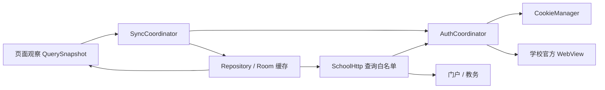
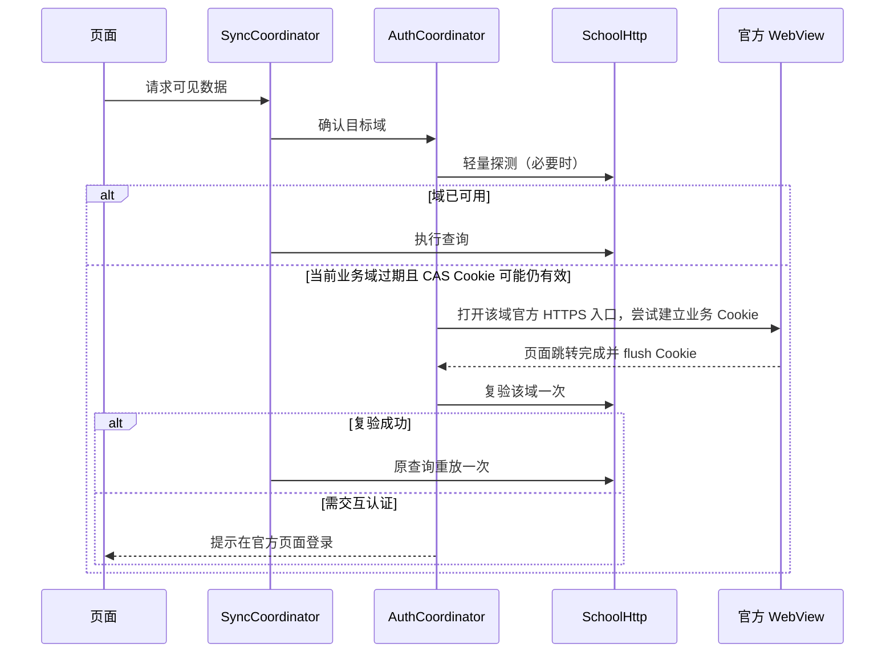

# 实时同步与会话保持设计

更新日期：2026-09-24。状态：前台刷新与可见登录恢复已落地，真机认证场景待验收。适用于当前 NEO NEU 原生 App 的门户、教务只读查询；接口范围与已验证程度见[接口参考](接口参考.md)和[验证清单](验证清单.md)。

最新补登修正：已有会话进入学校登录页时保留 CAS、门户与教务 Cookie，并轮换本地数据作用域隔离可能的换号；目标网页完成加载后自动复验，成功则返回原页面。首次登录和主动退出仍清理 Cookie。此修正改善学校单点登录可用时的恢复路径，尚未测得学校会话的实际寿命；后台静默恢复仍未实现。

追加[官方 WebView Cookie 核验](../research/official-app-cookie-runtime-2026-09-24.md)：教务入口 302 后重新取得 `JSESSIONID`，业务响应反复设置 `_WEU`；两者均未观察到显式到期属性。教务网页的正常请求确实更新 Cookie，但这不等于服务端会话无限续期。门户 `xgh` 与教务 `userId` 在一个账号样本中相同，可用于后续同账号验证研究；当前实现仍保守轮换缓存作用域。登录 WebView 已改走官方 App 使用的教务根入口，两域探针并发执行。

## 1. 目标与边界

用户每次打开 App、回到前台或进入数据页时，尽快看到学校接口的最新结果；网络不可用时展示当前账号上次成功的数据及其同步时间。登录成功后尽量复用学校有效会话；会话失效时优先尝试学校已有的单点登录状态，再请用户在官方页面完成认证。

“实时”定义为**前台按需获取**，不是承诺服务器主动推送或后台每秒轮询。学校接口没有在本项目中验证出增量订阅、变更通知或稳定的令牌续期协议。校园网、WebVPN、CAS 和各业务域的有效期由学校控制，本应用不能保证永不掉线。

首版继续只调用 `SchoolCall` 中列明的只读业务操作。教务查询使用 POST 是学校现有查询协议；不得因 HTTP 方法为 POST 就误认为可以调用课表确认、考试签到、消息已读等写接口。不保存或自动提交学校密码，不绕过验证码或二次认证，不伪装官方 App 的设备标识。

## 2. 当前实现与官方 APK 观察

### 本项目现状

| 位置 | 已有能力 | 与目标有关的缺口 |
| --- | --- | --- |
| `data/session/LocalSession.kt` | 使用 Android `CookieManager`，门户与教务分域状态，本地随机账号作用域 | 仅有手动 WebView 登录和探针；Cookie 写入的异步完成未统一协调；当前作用域不能识别学校账号是否在网页内被切换 |
| `data/network/SchoolHttp.kt` | 查询白名单、按域附加 Cookie、处理 302/401/403/HTML 登录页 | 请求发现过期后直接向页面报错；缺少单次会话恢复与原查询重放；403 的具体含义需按业务核验 |
| `data/network/SessionProbe.kt` | P01/A01 双域探测，重启后复验 | 两域串行，成功探测后页面又请求部分相同数据；业务响应中的更多失效形态仍需核验 |
| `data/repository/CampusData.kt` | Room 缓存、账号作用域、失败保留旧数据、同一 key 的 Mutex | 每次 `refresh` 都发请求；没有统一新鲜度、全局并发/退避、跨页面请求合并；内存锁以外没有刷新协调 |
| `app/MainActivity.kt`、各页面 | 启动及页面进入时主动刷新，部分页面有手动刷新 | 启动、今日页及详情页可能重复请求；从后台返回时没有统一刷新策略；页面发起请求分散 |
| `integration/auth-web/OfficialLoginActivity.kt` | 用户在学校 HTTPS 页面登录，完成后探测两域 | 仍需用户手动点击“检查连接”；一域过期时没有可控的自动恢复流程 |

上述代码与 2026-09-23 的独立查询实测只能说明当时的 Cookie 在进程重启后仍可用，不能推导学校给了多长有效期。

### 官方 APK 可确认的范围

对用户提供的 `C:\Users\BLACKCAT\Downloads\base.apk` 做了本地只读检查；其 SHA-256 与仓库根目录的 `base.apk` 相同，包名 `com.sunyt.testdemo`，应用名“智慧东大”，版本 `3.1.8`。包内有 Flutter 资源、`libapp.so`、WebView 相关插件。可见字符串包括 `saveCookiesToLocal`、`saveInAppSyncCookie2Dio`、`_doAutoLogin`、`_doReLoginAndReload`、`_refreshAllData`、`refreshJwt.result`、`neu_auto_login_retried`。这些**支持“官方包存在 Cookie 同步、自动登录/重载及刷新逻辑”这一线索**，但字符串可能来自不同学校模块、通用库或未执行代码，不能证明东北大学当前登录路径的具体实现、请求周期、令牌接口或成功率。`WAKE_LOCK`、前台服务和推送权限也不能证明它通过保活维持教务登录。

官方包并非只有 WebView：`libapp.so` 中还出现 `Dio`、`cookieJar` 及东北大学门户的 `/personal/frontend/data/info_app`、`items_app`、`detail_app`、`/schedule/frontend/calendar/appCalendar`、`/manage/common/app_login/check` 等 URL 字符串。其 Flutter 页面可能直接请求 App 专用接口，同时把其他功能放进远端网页；现有项目使用的 P01/P02/P03 等主要是**网页接口**。仅有字符串不足以确认这些 App 专用接口的请求方法、参数、响应和认证要求，不能直接替换现有白名单。

已保存的[门户网页脚本](../research/portal-source/index-DGaJQ_v2.js)可确认：Axios 使用 `withCredentials`，`e=10013` 时根据 `d.loginUrl` 跳转登录；这是网页自己的恢复行为，并未证明 Flutter 容器会替它自动续登。[接口参考](接口参考.md)记录了教务网页的 `jwAjax` 查询链路。匿名直接访问门户会转到 WebVPN/CAS，教务及 App 登录检查地址在当前外部访问环境不可直接读取，因此在初稿阶段尚无官方 App 运行时请求与 Cookie 生命周期证据；后续请求元数据验证见下文。

2026-09-24 追加模拟器运行时验证：官方 App 的日程 WebView 两次进入相隔约 16 秒，均向门户发送个人信息、日历和日程列表请求；教务 WebView 实际请求了 `/jwapp/sys/homeapp/api/home/` 下的首页接口。首次教务入口出现 302，紧接着连接 `pass.neu.edu.cn`；稍后再次进入教务入口返回 200，并取得多个业务接口 HTTP 200。仅记录元数据，未检查业务响应正文，因此 HTTP 200 不等于逐项业务成功。详细边界见[运行时采集记录](../research/official-app-runtime-2026-09-24.md)。Cookie 生命周期仍未验证。

因此方案借鉴其“页面进入重新取数、失效后恢复”的方向，具体协议仍以本项目实测为准，不复制 APK 中未核验的私有接口。原生查询和 WebView 的登录共享关系必须作为独立验收项。

### 需要补做的 Web 容器核验

在用户本人已登录的测试设备上，分别观察官方 App 的首页、门户网页页、教务网页页及从后台恢复后的行为。只在本机保留脱敏记录：页面 URL 的主机与路径、请求方法、接口名称、响应状态/业务码、相对时间、Cookie **名称与作用域**及是否更新；不记录值、票据、个人响应或原始 HAR。每个场景核对：

1. 页面是 Flutter 直接调 App 专用接口，还是 WebView 加载远端页面并由网页 JS 调接口；若二者同时存在，画出具体页面到请求的映射。
2. 首页第一次打开、下拉刷新、切标签、锁屏后返回、杀进程重开各发了哪些请求；是否仅重新取数，还是先走 `/app_login/check` 或 CAS。
3. WebView 与 Flutter/Dio 是否同步同一域 Cookie；新 Cookie 从哪个响应产生；`e=10013`、302、200 登录 HTML 分别如何处理。
4. 门户、教务、CAS、WebVPN 各自过期时能否单独恢复；验证码/MFA 是否需要用户操作；是否存在可验证的有效期或刷新端点。

完成这些核验后，决定是否在项目里增加 App 专用接口适配。若专用接口更适合移动端且可稳定回放，优先采用经过验证的只读接口；若仅网页接口可用，继续使用现有适配器并按本设计调度。两种路径均不以“官方包有这个字符串”作为接口已可用的依据。

## 3. 整体结构

`SyncCoordinator` 是唯一自动刷新入口，页面只声明“当前需要哪些数据”和用户手动刷新事件。`AuthCoordinator` 管理门户与教务各自的认证状态及一次性恢复。Repository 保留现有数据解析、Room 缓存和 `QuerySnapshot`，但增加请求元数据：`lastAttemptAt`、`lastSuccessAt`、`freshUntil`、`source`、`inFlight` 和可读错误。已有 `lastSuccessEpochMillis` 是**本机获取成功时间**，不能写成学校数据更新时间。

## 4. 刷新策略

### 触发与新鲜度

| 场景 | 行为 |
| --- | --- |
| 冷启动 | 立即显示当前作用域缓存，恢复 Cookie 后请求首页可见数据；让业务查询兼作会话验证，避免先探测再请求同一接口 |
| App 回到前台 | 对当前可见业务数据刷新一次；短时间重复生命周期事件合并为同一轮；不全量刷新隐藏页面 |
| 切到主标签或进入详情 | 立即显示缓存，每次真实进入均请求当前业务数据；重组不算进入；详情只查当前用户从列表取得的 ID |
| 手动下拉/刷新按钮 | 立即刷新，仍加入同 key 的正在执行请求；显示实际刷新结果与时间 |
| 网络恢复 | 当前处于前台且可见数据过期时刷新一次；避免网络抖动造成连续风暴 |
| 筛选、学期、教学周改变 | 新 key 先查缓存，再查询该 key；返回旧筛选项也刷新业务数据 |

建议初始前台驻留检查间隔（可配置，后续按流量与学校表现调整）：下面数值只用于持续停留页面时的自动检查，不得据此跳过冷启动、重新进入、回到前台或手动刷新的业务查询。字典元数据可保留独立缓存有效期。

| 数据 | 驻留检查间隔 / 元数据有效期 | 理由 |
| --- | --- | --- |
| 消息未读、待办、余额 | 60 秒 | 变化相对频繁，用户常看 |
| 当前周课表、考试 | 3 分钟 | 变更需要及时看到，同时避免频繁请求多校区链路 |
| 成绩列表、GPA | 5 分钟 | 发布时需及时，但平时变化少；用户可手动刷新 |
| 学期、教学周、校区、节次字典 | 30 分钟 | 用于后续请求的元数据，学期切换时强制更新 |
| 历史学期成绩、成绩详情 | 不自动轮询 | 每次进入及手动操作时刷新 |

这是客户端持续停留页面时的检查策略，不是学校数据有效期，也不是已测得的官方轮询周期。自动检查仅覆盖前台可见数据，离开即停止；真实页面进入绕过该间隔。同一轮生命周期及导航事件可用短窗口（建议 1 秒）合并，并共享正在执行的请求；手动刷新不受该短窗口限制。失败保留上次成功时间；缓存继续显示并标记失败原因。对于余额、消息、成绩等敏感值，后台预览和通知仍遵循隐私设置。

### 请求预算与调度

1. 以 `accountScope + SchoolCall + 规范化参数` 为请求 key。对相同 key 使用 single-flight：同一时刻只有一条网络请求，页面共享同一结果。手动刷新若已有请求在执行，则等待它，不另发一条。
2. 门户与教务分别限制并发，初始每域最多 2 条；课表的“学期 → 周次/校区 → 每校区节次/课表”按依赖执行，多校区也受并发上限约束。今日页、`MainActivity` 和课表页不再各自独立触发同一链路。
3. 按可见性排序：当前页面 > 首页可见卡片 > 预取。首屏不为历史学期、非当前分页或隐藏服务全量抓取。页面退出时可取消无消费者的低优先级请求。
4. 网络、5xx/429 使用带抖动的指数退避，例如 5 秒、15 秒、45 秒，上限 5 分钟；尊重 `Retry-After`（若服务提供）。同一数据连续失败后，只有手动刷新、网络恢复或下次前台进入才可提前重试。认证失败不走普通网络退避。
5. 不做无限循环。每次请求设置超时，解析和入库失败也必须结束 `inFlight`。仅对当前作用域写回；退出或换号时取消旧作用域请求并清除旧缓存。

## 5. 会话保持与恢复

### 状态与流程

认证状态按门户和教务分别维护：`UNVERIFIED → READY / EXPIRED / UNREACHABLE`。`UNREACHABLE` 表示网络或服务暂时不可达，不当作退出；门户可用不代表教务可用。`AUTHENTICATING` 期间不发后台业务查询。

**关键原则：保持的是可恢复性，不是定时“刷活”会话。**每次成功响应接受该域 `Set-Cookie`，让 WebView CookieManager 与原生请求共用同一 Cookie 来源。App 重启只读取已有 Cookie 并验证，不清空有效会话；用户主动退出才清除 Cookie 和本地作用域。若服务器主动延长会话，正常使用的请求自然取得新 Cookie；若学校采用绝对失效时间，请求频繁也不能延长。

恢复分两级：

1. **静默尝试一次**：仅当目标域明确过期、网络可用且用户不处于登录页时，用受限的学校官方 HTTPS 页面建立该域会话；等待主框架导航完成和 Cookie 写入回调/`flush()` 后复验。仅可访问批准的学校主机与入口，不向页面注入脚本，不读取表单，也不自动提交密码。后台静默 WebView 的行为和学校页面跳转是否允许，必须先实测；如不稳定，直接使用用户可见的官方登录页。
2. **用户交互**：遇到验证码、MFA、账号确认、CAS 票据失效、跨域/WebVPN 异常或静默尝试失败，打开现有 `OfficialLoginActivity` 到失效的域。另一域仍可查询。用户完成后按域复验，再刷新先前失败的可见数据。

每域同一时间只允许一个恢复流程；一次过期事件最多自动恢复一次、原业务查询最多重放一次。明确识别 HTTP 302/401、200 HTML 登录页、门户 `e=10013` 及经样本确认的教务失效码。403 只有确定是会话问题时才进入恢复，否则保留 `FORBIDDEN`。避免循环重定向和无限登录重试。

账号切换是单独风险：当前 `accountScope` 只是随机本地分区，网页内换号可能把新账号数据写到旧作用域。正式启用静默恢复前，需从已授权的 P01/A01 响应中选择**稳定且两域可核对的账号标识**，仅在内存中处理原值；若需要跨进程比对，使用 Android Keystore 保护的本地密钥计算 HMAC 并保存校验值，不保存原始学号，也不在日志记录。若无法可靠比对，则任何网页内换号都要求先执行“退出并清除本地数据”，恢复流程不能跨账号复用缓存。

### Cookie 写入一致性

当前 `acceptSetCookie()` 对 `CookieManager.setCookie()` 逐条调用后立即 `flush()`。建议将其改为串行 suspend 写入：等每条回调完成，再 `flush()`，然后才允许紧接着的探针/重放。对响应的 Cookie 仅使用原响应 URL 写入，交由 CookieManager 处理域与路径；绝不把门户 Cookie 手工复制到教务或 CAS 域。记录可脱敏的域、Cookie 数量和恢复结果，不记录值、票据、完整重定向 URL。

## 6. 后台策略

首版以**前台实时**为主要体验。无服务器推送协议时，后台高频轮询既不能保证实时，也可能造成电量、流量和学校接口负担。若以后确有“考试变更/新消息通知”的产品需求，可为用户显式开启的类别添加 `WorkManager` 周期任务：联网约束、至少 15 分钟间隔、只查最小数据、受系统调度延迟影响；认证失效时不在后台弹登录页。Android Doze 会延迟后台任务和网络，不能承诺固定分钟级通知。参见 [Android 周期任务](https://developer.android.com/reference/androidx/work/PeriodicWorkRequest)、[Doze 与 App Standby](https://developer.android.com/training/monitoring-device-state/doze-standby)。

官方 APK 的推送与保活权限不构成本项目申请后台定位、忽略电池优化、常驻前台服务或 WakeLock 的理由。除非学校提供可供本应用使用的正规推送/订阅接口，不设计后台常驻连接。

## 7. 代码落点与实施顺序

1. 在 `core/contract` 增加刷新原因、同步元数据及面向 UI 的统一状态；保留现有 `QuerySnapshot` 消费方式，避免一次性重写页面。
2. 在 `data/repository` 增加 `SyncCoordinator`：可见 key 注册、TTL、single-flight、域并发限制、退避、取消和网络恢复触发。把 `MainActivity`、今日页、课表/成绩/考试/余额/消息/待办页的分散 `refresh*()` 收敛到这里；用户手动刷新入口仍保留。
3. 在 `data/session` 和 `data/network` 增加 `AuthCoordinator`：Cookie 写入等待、按域探针、过期分类、一次恢复、一次重放和作用域检查。先用**可见官方登录页**完成恢复闭环，再在真机证实可行后启用静默入口尝试。
4. 增加账号一致性验证与换号清理；完成前禁用可能跨账号使用缓存的自动恢复路径。
5. 最后再评估可选后台周期通知；首版不依赖它达成前台体验。

## 8. 验收标准

- 同一冷启动的同一接口+参数只发一次请求；同一轮今日页、课表页联动共享请求。用户离开再进入课表时重新查询，不因 3 分钟缓存窗口跳过。手动刷新仍能立即请求。
- 冷启动、前台恢复、离线、网络恢复均先显示当前作用域缓存并准确标注上次成功时间；数据刷新成功后原位更新，不以失败覆盖为 0 或空列表。
- 门户单独过期时教务仍能用，反之亦然；自动恢复最多一次且只重放一次。验证码或 MFA 必须转到用户可见官方页面。
- 杀进程后有效 Cookie 能继续使用；学校强制到期时明确提示重新认证。退出或换号后旧数据不可见，旧请求不能写回新作用域。
- 真机记录请求数量、耗时、成功/失效类别、各域恢复次数和前台数据年龄；仅记录脱敏统计，不保留响应原文或任何 Cookie/票据。分别在校园网、校外网络、重启、断网、Doze 下验证，未验证场景不宣称成功。

方案优先实现前台刷新协调，再做会话恢复。这样即使学校不允许静默续登，用户仍可在每次打开页面时取得尽可能新的数据，并在失效时得到明确的恢复入口。

## 9. 2026-09-24 实施记录

本轮实现按“前台调度 → 请求与 Cookie 一致性 → 可见恢复”推进。`app/SyncCoordinator` 统一接收冷启动、导航进入、返回前台、手动刷新和登录返回事件，只刷新当前路由所需数据；课表、成绩、考试、消息、待办、校历页面注册当前筛选参数，避免前台恢复时误查默认学期或第一页。导航与生命周期在 900ms 内合并，真实离开再进入会重新查询。今日页和 `MainActivity` 原有重复自动入口已移除；筛选或分页变化仍由页面发起，并进入同一 Repository/HTTP 调度链。没有使用几分钟 TTL 跳过真实页面进入。

`SchoolHttp` 按本地账号作用域、白名单接口和排序后的参数执行 single-flight；门户、教务分别最多并发两条。调用可取消，网络请求 30 秒超时；网络、维护、5xx、429 按 5/15/45 秒至 5 分钟退避并尊重 429 的 `Retry-After`。真实页面进入、前台恢复和手动刷新可提前重试。HTTP 304、普通重定向、已知认证跳转、403、登录 HTML 和维护 HTML 分开分类；教务未知业务码仍按结构异常处理，不猜测其认证语义。

Cookie 读写由 `LocalSession` 同一互斥锁协调，响应 `Set-Cookie` 逐条等待 WebView 回调后 flush，才向业务层返回。退出先失效本地作用域并取消旧请求，再等待 Cookie 操作并清除 Cookie。用户打开可见学校登录页时，因 P01/A01 还没有可核对的共同账号标识，先轮换本地作用域、清理旧缓存和全部旧学校 Cookie，再加载官方页面。两个业务域随后分别探测、分别报告；进入恢复前一域失效不会把另一域误判退出，进入可见重新认证后则需按需重新连接两域。这一保守路径牺牲了 CAS Cookie 无感续登，避免网页内换号后混用旧账号数据。`AuthCoordinator` 将一次可见恢复与一次目标域验收后的原页面刷新绑定，并在恢复中抑制 `onResume` 的重复请求。没有启用隐藏 WebView、自动提交密码或新接口。

本轮没有实现驻留页面的定时检查或网络恢复广播监听；当前保证的是冷启动、真实进入、返回前台和显式重试。可见登录后的 Cookie、目标域恢复、跨账号切换以及请求计数仍须在本人登录设备上验收，不能据单元测试或构建声称学校会话已长期稳定。
